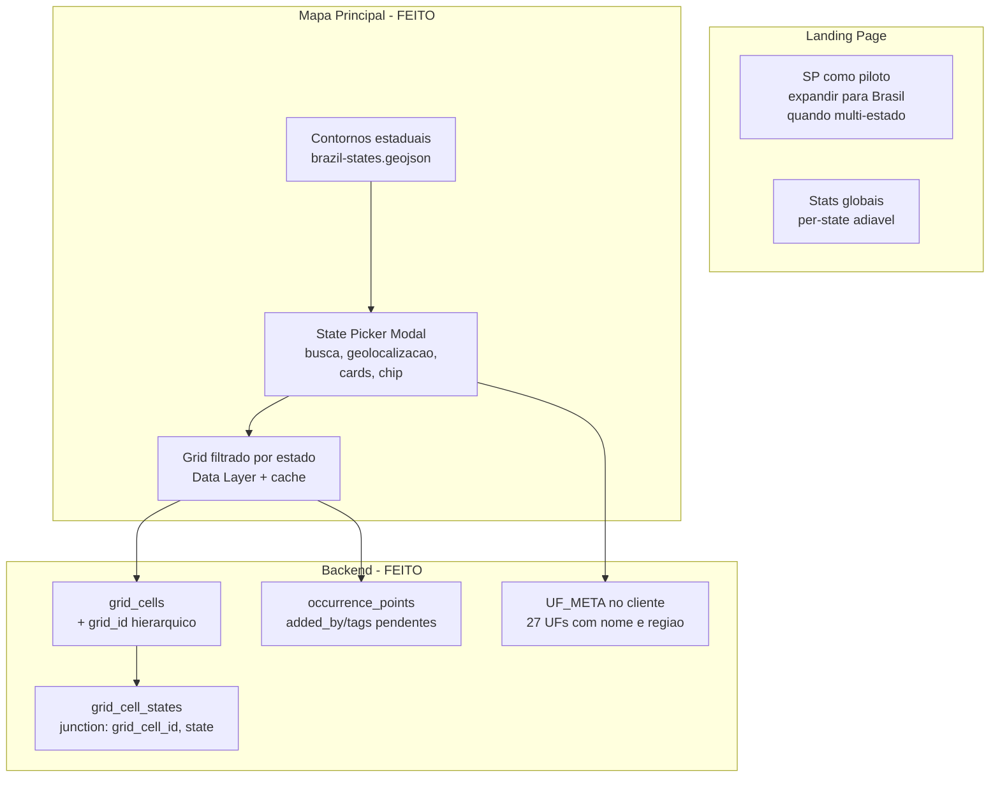
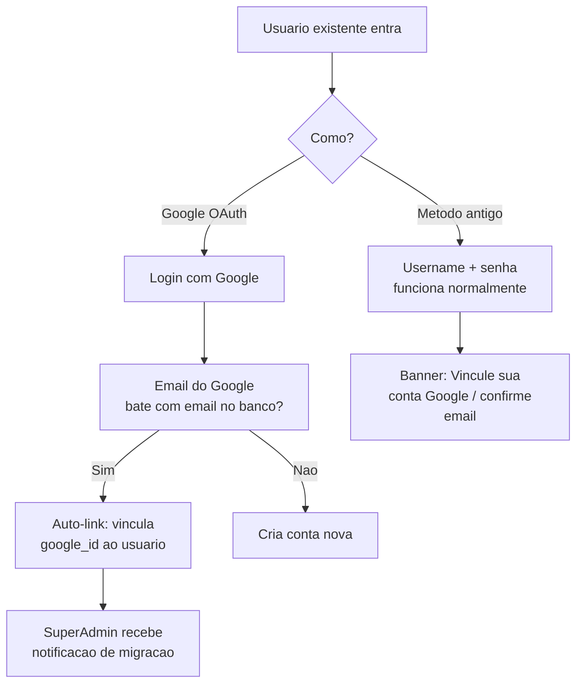

# Expansao do leucaena.earth para o Brasil

## Status de implementacao

**Como usar:** ao terminar uma sessao (ou parte dela), atualize a linha correspondente na tabela abaixo e a data em **Ultima revisao**. Valores sugeridos: `Feito` | `Parcial` | `Pendente`.

**Ultima revisao:** 2026-04-13 (Revisao completa da Fase 2 — muitos itens ja implementados fora do plano)

**Fase 1 — Sessoes 1 a 5:** concluidas (ver notas por sessao abaixo).
**Fase 2 — Sessoes 6 a 12:** revisadas. Sessoes 7 e grande parte da 6 e 11 ja foram feitas. Sessoes 8-9 (tags/pontos collab) e 10/12 (landing/i18n Brasil) adiaveis.

### Fase 1 — Fundacao

| Sessao | Status | Notas |
|--------|--------|--------|
| **1** — Autenticacao (Google + e-mail/senha, fim do passcode) | **Feito** | OAuth (`/auth/google`, callback), Registro + Resend + verificacao, colunas `users`, banner de migracao, auto-link por e-mail, vincular Google no perfil, passcode removido. |
| **2** — Admin: vinculacao manual + notificacao de migracao | **Feito** | **Escopo fechado (2026-04-06):** no painel admin, cada usuario mostra badge **Google** (tem `google_id`) vs **E-mail / senha** (sem Google vinculado). Fora de escopo: vinculacao manual pelo admin com e-mail Google diferente; alerta dedicado por auto-link (mantem-se `logActivity` existente). |
| **3** — `grid_cells.state` + `GET /api/grid?state=` | **Feito** | Tabela de juncao `grid_cell_states(grid_cell_id, state)` para multi-estado (celulas de fronteira). Migrada da coluna legada `state` (backfill SP). `GET /api/grid?state=UF` filtra via junction table; `properties.states` e array (`["SP"]`, `["SP","MG"]`). Export grid-status inclui `states`. Seed.js insere na junction table. |
| **4** — Data Layer + cache + gzip | **Feito** | Grid migrado de google.maps.Polygon para google.maps.Data Layer (canvas rendering). Cache em memoria (gridCache). loadStateGrid(uf) para carregamento por estado. gzip ja ativo via compression(). Idle listener sem viewport cull (Data Layer faz internamente). |
| **5** — Inbox + e-mail | **Feito** | Base do plano (0.6): `messages`/`message_reads`, Resend, sino+badge, modal, admin compose. Evolucoes: threads/accordion; mensagens usuario→superadmins; respostas ao remetente+superadmins; confirmacao de envio (modal); editor WYSIWYG (negrito, alinhamento, listas, imagens ate 2); anti-spam (rate limit, cooldown, limite diario, caracteres); mensagens de boas-vindas; filtro historico por data de conta; `DELETE /api/messages/:id` (superadmin); logs de atividade; correcoes UX (toast duplicado no login, sem toast "conectado ao servidor"). |

### Fase 2 — Expansao Brasil

| Sessao | Status | Notas |
|--------|--------|--------|
| **6** — DB `states`, tags, APIs | **Feito (parcial)** | Tabela `states` descartada — `grid_cell_states` (junction) + `UF_META` no cliente substitui. `GET /api/states` implementado (contagens). `seed_brazil_grid.js` insere celulas e preenche junction. `added_by`/`added_by_role` em `occurrence_points` implementado (2026-04-13): colunas, INSERT em `POST /api/points` e import, exposto em `GET /api/points` e socket. **Pendente e adiavel:** `point_tags`/`point_tag_assignments`, `GET /api/states/:uf/stats`. |
| **7** — Contornos UF + seletor no mapa | **Feito** | Supera o plano original: `brazil-states.geojson` presente; `_loadStateOutlines()` + `_applyStateOutlineFilter()` em `map.js`; state picker modal com busca, geolocalizacao, "Brasil inteiro", cards com contagem, chip no topbar, `localStorage`; `loadStateGrid(uf)` com cache; restricao de pan por estado; filtragem de pontos e mascaras por estado (2026-04-13). |
| **8** — API pontos/tags/stats (backend) | **Feito (parcial)** | `GET /api/states/:uf/stats` implementado (contagens celulas, mascaras, pontos, area). `POST /api/points` aberto para qualquer usuario verificado. `DELETE /api/points/:id` restrito: colaboradores so deletam pontos proprios (`added_by == username`); team+ deleta qualquer. **Pendente e adiavel:** CRUD de tags, `landing-stats` per-state. |
| **9** — UI pontos + tags | **Feito (parcial)** | Botoes "Add Pontos" e "Remover Pontos" visiveis para todos os usuarios verificados (antes so team+). Botoes estilizados com icones SVG e cores distintas (verde=add, vermelho=remove). Banner de exclusao diferenciado para colaboradores ("apenas pontos que voce adicionou"). Toast amigavel ao tentar deletar ponto de outro usuario. **Pendente e adiavel:** seletor de tags visual. |
| **10** — Landing + SEO Brasil | **Adiado** | Landing ainda centrada em SP. Mudar para "Brasil" so faz sentido com grid real de 2-3+ estados. Sessao simples quando chegar a hora (copy + meta tags). |
| **11** — Script geracao de grids | **Feito (parcial)** | `scripts/seed_brazil_grid.js` insere celulas a partir de GeoJSON nacional pre-gerado e preenche `grid_cell_states`. `delete_grid_cells_from_geojson.js` para remocao. Gerador geometrico (criar celulas do zero a partir de limites IBGE) feito via QGIS/Python no workflow GIS — nao precisa de script Node. |
| **12** — i18n nacional | **Adiado** | Strings de funcionalidades novas (Street View, layers, dedup, etc.) ja estao no i18n.js. State picker usa strings hardcoded em PT no HTML. Alinhar com Sessao 10 quando expandir para Brasil. |

---

## Visao geral da arquitetura




## Parte 0: Autenticacao moderna — Google OAuth + Email/Senha com verificacao

### Decisoes
- **Remover passcode** completamente (cadastro aberto)
- **Google OAuth**: gratuito via Google Cloud Console
- **Email/senha**: cadastro com verificacao por email via **Resend** (gratuito: 100 emails/dia, 3.000/mes)
- **Migracao dos 22 usuarios**: auto-link por email (se o email do Google bater com o email cadastrado, vincula automaticamente)

### 0.1 Google OAuth — setup

- Criar projeto no [Google Cloud Console](https://console.cloud.google.com/)
- Configurar OAuth consent screen (nome: "Leucaena Earth", logo, dominio)
- Criar credenciais OAuth 2.0 (Client ID + Client Secret)
- Env vars no Render: `GOOGLE_CLIENT_ID`, `GOOGLE_CLIENT_SECRET`
- Redirect URI: `https://leucaena.earth/auth/google/callback`

### 0.2 Mudancas no banco — tabela `users`

```sql
-- Novas colunas na tabela users
ALTER TABLE users ADD COLUMN google_id TEXT;          -- ID unico do Google
ALTER TABLE users ADD COLUMN auth_provider TEXT DEFAULT 'local'; -- 'local' ou 'google'
ALTER TABLE users ADD COLUMN email_verified INTEGER DEFAULT 0;
ALTER TABLE users ADD COLUMN verification_token TEXT;
ALTER TABLE users ADD COLUMN verification_expires TEXT;
```

### 0.3 Novos endpoints no server.js

- `GET /auth/google` — redireciona para tela de login do Google
- `GET /auth/google/callback` — recebe o retorno do Google, cria/vincula usuario, gera JWT
- `POST /api/auth/register` — cadastro com email/senha (novo fluxo sem passcode)
  - Valida email unico
  - Envia email de verificacao via Resend
  - Conta fica inativa ate verificar
- `GET /api/auth/verify-email?token=xxx` — confirma email e ativa conta
- `POST /api/auth/resend-verification` — reenvia email de verificacao

### 0.4 Migracao dos 22 usuarios — periodo de transicao

**Principio**: login antigo (username+senha) continua funcionando. Novos metodos sao adicionados em paralelo.



- **Login antigo continua**: username + senha funciona normalmente durante a transicao
- **Banner de migracao**: ao logar pelo metodo antigo, banner superior pede para vincular Google ou confirmar email
- **Auto-link por email**: se email do Google bater com `users.email`, vincula automaticamente
- **Notificacao ao superadmin**: a cada migracao bem-sucedida, superadmin recebe alerta (via inbox + email)
- **Vinculacao pelo perfil**: usuario logado pode ir no perfil e clicar "Vincular conta Google"

### 0.5 Ferramenta admin — vinculacao manual de contas

No painel admin, para cada usuario:
- Botao "Vincular Google" → admin digita o email Google do usuario → sistema vincula o `google_id`
- Util para cenarios onde o email cadastrado e diferente do email Google
- Log de atividade registra quem fez a vinculacao

### 0.6 Sistema de Inbox — mensagens e notificacoes por email

#### Tabelas no banco

```sql
CREATE TABLE IF NOT EXISTS messages (
  id INTEGER PRIMARY KEY AUTOINCREMENT,
  sender TEXT NOT NULL,            -- username do admin que enviou
  subject TEXT NOT NULL,
  body TEXT NOT NULL,
  target TEXT NOT NULL DEFAULT 'all', -- 'all' ou username especifico
  created_at TEXT NOT NULL
);

CREATE TABLE IF NOT EXISTS message_reads (
  message_id INTEGER,
  username TEXT,
  read_at TEXT,
  PRIMARY KEY (message_id, username),
  FOREIGN KEY (message_id) REFERENCES messages(id)
);
```

#### Endpoints

- `POST /api/admin/messages` — admin envia mensagem (para todos ou usuario especifico)
  - Salva no banco
  - Envia email via Resend para o(s) destinatario(s) que tem email
- `GET /api/messages` — usuario ve suas mensagens (filtro: nao lidas, todas)
- `PUT /api/messages/:id/read` — marca mensagem como lida
- `GET /api/messages/unread-count` — retorna contagem de nao lidas (para badge)

#### UI

- **Icone de sino/envelope** no topbar com badge de nao lidas
- **Modal de inbox**: lista de mensagens com assunto, data, status lido/nao-lido
- **Painel admin**: area para compor mensagem, selecionar destinatario (todos / usuario especifico)
- **Email**: cada mensagem tambem chega por email (Resend), com template bonito e link para a plataforma

#### Casos de uso

- Avisar usuarios sobre a migracao de autenticacao
- Comunicar novas funcionalidades
- Coordenar mapeamento em estados especificos
- Contato direto com colaboradores como o Marcos do MS

### 0.7 Remocao do passcode

- Remover `getNextPasscode()` e logica de passcode do `server.js`
- Remover campo de passcode do modal de registro no `app.js` e `index.html`
- Remover display do passcode no painel admin
- Modal de login passa a ter: botao "Entrar com Google" + formulario email/senha + link "Criar conta"
- Modal de registro: nome, email, senha, botao "Criar conta" + botao "Cadastrar com Google"

### 0.8 Dependencias novas

- `resend` (npm) — envio de emails (verificacao + inbox)
- `googleapis` ou usar OAuth2 manual via HTTP (sem lib extra, mais leve)

### 0.7 UI do novo login/cadastro

```
+----------------------------------+
|       Entrar no leucaena.earth   |
|                                  |
|  [G] Entrar com Google           |
|                                  |
|  ──────── ou ────────            |
|                                  |
|  Email:    [____________]        |
|  Senha:    [____________] 👁     |
|                                  |
|  [     Entrar     ]              |
|                                  |
|  Nao tem conta? Criar conta      |
+----------------------------------+
```

---

## Parte 1: Mudancas no banco de dados ([db.js](c:\Users\mathe\OneDrive\Documents\leucaena-earth-platform\db.js))

### 1.1 Estados (UF) — decisao de projeto (nao usar tabela `states`)

**Nao implementar** a tabela `states` nem seed SQL dos 27 UFs nesse formato.

**Modelo adoptado:** (1) **`grid_cell_states`** em `db.js` — cada linha liga uma celula do grid a uma UF; contagens e filtro `GET /api/grid?state=` vêm daqui; células de fronteira têm várias linhas. (2) **`UF_META`** em `public/js/app.js` — nome completo e região dos 27 estados + DF para o seletor no mapa (metadado só no cliente). (3) **`GET /api/states`** em `server.js` — lista UFs que têm pelo menos uma linha em `grid_cell_states`, com `cell_count` (não devolve centro/zoom/status por UF como o plano original descrevia).

Reintroduzir uma tabela `states` no servidor só faria sentido se precisasses de campos por UF na base (ex.: `coming_soon`, `priority`, centro oficial vindo só do BD).

<details>
<summary>Referencia historica — SQL originalmente previsto (nao aplicar)</summary>

```sql
CREATE TABLE IF NOT EXISTS states (
  uf TEXT PRIMARY KEY,
  name TEXT NOT NULL,
  status TEXT DEFAULT 'available',
  priority INTEGER DEFAULT 0,
  grid_generated INTEGER DEFAULT 0,
  center_lat REAL,
  center_lng REAL,
  zoom_level INTEGER DEFAULT 7
);
```

</details>

### 1.2 Nova tabela `point_tags` (sistema flexivel)

```sql
CREATE TABLE IF NOT EXISTS point_tags (
  id INTEGER PRIMARY KEY AUTOINCREMENT,
  name TEXT UNIQUE NOT NULL,    -- 'aglomerado', 'arvore_isolada', 'zona_misturada'
  label_pt TEXT NOT NULL,
  label_en TEXT,
  label_es TEXT,
  color TEXT,                   -- cor no mapa
  icon TEXT,                    -- icone opcional
  is_default INTEGER DEFAULT 0  -- tags padrao nao podem ser deletadas
);
```

### 1.3 Nova tabela `point_tag_assignments`

```sql
CREATE TABLE IF NOT EXISTS point_tag_assignments (
  point_id INTEGER,
  tag_id INTEGER,
  PRIMARY KEY (point_id, tag_id),
  FOREIGN KEY (point_id) REFERENCES occurrence_points(id),
  FOREIGN KEY (tag_id) REFERENCES point_tags(id)
);
```

### 1.4 Migracoes em tabelas existentes

- `**grid_cells**`: adicionar coluna `state TEXT` (UF do estado)
- `**occurrence_points**`: adicionar colunas `added_by TEXT`, `added_by_role TEXT` (para rastreabilidade)

### 1.5 Seed das tags padrao

Inserir na inicializacao: `aglomerado`, `arvore_isolada`, `zona_misturada` com `is_default = 1`

### 1.6 Seed dos estados no SQLite (obsoleto — nao fazer)

O plano original pedia **INSERT** dos 26 estados + DF na tabela `states`. Isso **nao se aplica**: não há tabela `states`. Metadado de UF para a UI está em **`UF_META`**; dados de cobertura vêm de **`grid_cell_states`** (preenchido com o grid existente, `seed.js`, `seed_brazil_grid.js`, migracoes).

---

## Parte 2: API — novos endpoints e mudancas ([server.js](c:\Users\mathe\OneDrive\Documents\leucaena-earth-platform\server.js))

### 2.1 Estados

- **`GET /api/states` (implementado)** — resposta publica: por UF que existe em `grid_cell_states`, campos `state` + `cell_count` (agregado `GROUP BY state`). Nomes de estado/região vêm do cliente (`UF_META`), não deste endpoint.
- **`GET /api/states/:uf/stats` (adiavel)** — stats detalhados por UF; ainda nao implementado; usar quando landing ou outra UI precisar.

### 2.2 Grid filtrado por estado

- `GET /api/grid` — adicionar query param `?state=SP` para filtrar grids por estado (backward-compatible: sem param retorna todos)

### 2.3 Pontos — abrir para colaboradores

- `POST /api/points` — remover restricao `isTeamOrAbove`; qualquer usuario autenticado pode adicionar pontos
- Gravar `added_by` (username) e `added_by_role` (role no momento da criacao)
- Manter log de atividade

### 2.4 Tags

- `GET /api/point-tags` — lista todas as tags disponiveis
- `POST /api/point-tags` — admin cria nova tag
- `PUT /api/point-tags/:id` — admin edita tag
- `DELETE /api/point-tags/:id` — admin deleta tag (so se nao for `is_default`)
- `POST /api/points/:id/tags` — atribuir tags a um ponto
- `DELETE /api/points/:id/tags/:tagId` — remover tag de um ponto

### 2.5 Landing stats

- `GET /api/landing-stats` — adicionar contagem por estado e total nacional

---

## Parte 3: Performance — Arquitetura de 3 niveis para o Brasil

### Problema atual
- **817 celulas** para SP → **~50k-100k celulas** para o Brasil inteiro
- Tudo carregado de uma vez (`GET /api/grid` sem filtro)
- Um `google.maps.Polygon` por celula + 2 listeners por poligono
- Para o Brasil, isso **travaria o navegador**

### 3.1 Modelo de 3 niveis

```
Nivel 1: BRASIL (zoom 4-6)
  → 27 poligonos de estado (contornos IBGE simplificados)
  → Coloridos por status: verde=ativo, cinza=disponivel, azul=em breve
  → Clicavel → vai para Nivel 2

Nivel 2: ESTADO (zoom 7-12)
  → Carrega SO as celulas daquele estado (GET /api/grid?state=SP)
  → Mostra grid com cores por status da celula
  → Clicavel → vai para Nivel 3

Nivel 3: CELULA (zoom 13+)
  → Celula individual com mascaras e pontos
  → Edicao, lock, draw
```

### 3.2 Migrar para google.maps.Data Layer ([map.js](c:\Users\mathe\OneDrive\Documents\leucaena-earth-platform\public\js\map.js))

**Antes** (atual):
```javascript
// 817x: um Polygon + 2 listeners por celula
const poly = new google.maps.Polygon({ paths, ...style, map: null });
poly.addListener('click', ...);
poly.addListener('mousemove', ...);
```

**Depois** (otimizado):
```javascript
// 1x: um Data Layer para TODAS as celulas
const gridLayer = new google.maps.Data();
gridLayer.addGeoJson(featureCollection);
gridLayer.setStyle(feature => ({
  fillColor: STATUS_COLORS[feature.getProperty('grid_status')],
  strokeColor: '#fff',
  fillOpacity: 0.4,
  strokeWeight: 1
}));
gridLayer.addListener('click', event => { /* unico listener */ });
gridLayer.setMap(map);
```

- **Performance**: Data Layer usa canvas interno do Google Maps, muito mais eficiente
- **Memoria**: 1 objeto em vez de N objetos
- **Listeners**: 1 click listener em vez de N
- **Estilo dinamico**: callback `setStyle` aplica cor por feature

### 3.3 Carregamento por estado

- `GET /api/grid?state=SP` — server filtra por `grid_cells.state`
- Ao trocar de estado:
  1. `gridLayer.forEach(f => gridLayer.remove(f))` — limpa celulas anteriores
  2. `fetch('/api/grid?state=MS')` — carrega novo estado
  3. `gridLayer.addGeoJson(newData)` — renderiza
- **Nunca** carrega mais de um estado por vez

### 3.4 Contornos estaduais (Nivel 1)

- Arquivo estatico: `public/data/brazil-states.geojson` (~200KB simplificado do IBGE)
- Carregado uma unica vez na inicializacao
- `statesLayer = new google.maps.Data()`
- Sempre visivel no zoom baixo, some ao entrar em um estado
- Cada estado: nome, UF, status, contagem de celulas/mascaras

### 3.5 Cache no cliente

```javascript
const gridCache = {};

async function loadStateGrid(uf) {
  if (gridCache[uf]) {
    gridLayer.addGeoJson(gridCache[uf]);
    return;
  }
  const res = await fetch(`/api/grid?state=${uf}`);
  const fc = await res.json();
  gridCache[uf] = fc;
  gridLayer.addGeoJson(fc);
}
```

- Ao voltar para SP depois de ver MS, usa cache — **zero latencia**
- Cache limpo ao recarregar a pagina (sessionStorage opcional para persistencia)

### 3.6 Compressao gzip

- Verificar que `app.use(compression())` esta ativo em `server.js`
- GeoJSON de 1MB → ~200KB com gzip (~80% reducao)
- Ja esta no `package.json` (`compression`), so garantir que esta sendo chamado

---

## Parte 4: Frontend — Mapa e seletor de estados

### 4.1 Seletor de estado ([map.js](c:\Users\mathe\OneDrive\Documents\leucaena-earth-platform\public\js\map.js) + [app.js](c:\Users\mathe\OneDrive\Documents\leucaena-earth-platform\public\js\app.js))

- Mapa inicia mostrando o **Brasil inteiro** (center: `{lat: -14.2, lng: -51.9}`, zoom: `4`)
- Adicionar **dropdown de estado** no topo do mapa (ou sidebar lateral)
- Ao selecionar um estado:
  - Zoom para o centro/bounds do estado
  - Carregar apenas os grids daquele estado (`GET /api/grid?state=SP`)
  - Carregar pontos daquela regiao
- SP fica destacado como "Area Prioritaria" com badge visual
- Estados sem grid mostram mensagem: "Quer mapear aqui? Entre em contato!"

### 4.2 Restricao de pan

- Atualmente o pan e restrito ao bounds do grid carregado
- Manter esse comportamento, mas ajustar para o estado selecionado (nao para Brasil inteiro)

### 4.3 Adicao de pontos por colaboradores ([app.js](c:\Users\mathe\OneDrive\Documents\leucaena-earth-platform\public\js\app.js))

- Habilitar botao de adicionar ponto para contributors
- Ao adicionar, mostrar seletor de tags (aglomerado, arvore isolada, zona misturada, etc.)
- Indicador visual de quem adicionou (team vs contributor) no mapa

---

## Parte 5: Landing page ([landing.html](c:\Users\mathe\OneDrive\Documents\leucaena-earth-platform\public\landing.html))

- **Hero**: "Mapeamento de *Leucaena* no **Brasil**" em vez de "Estado de Sao Paulo"
- **Subtitulo**: "Fase piloto em Sao Paulo — metodologia replicavel para todo o pais"
- **Mapa preview**: Mostrar mapa do Brasil com estados coloridos por status
- **Stats**: Total nacional + "X estados participando"
- **SEO/meta**: Atualizar para Brasil, manter SP como contexto do PhD
- **Structured data**: addressRegion para "BR", manter ESALQ/USP

---

## Parte 6: i18n ([i18n.js](c:\Users\mathe\OneDrive\Documents\leucaena-earth-platform\public\js\i18n.js))

- Atualizar strings que mencionam "Estado de Sao Paulo" para escopo nacional
- Adicionar strings para: seletor de estados, tags de pontos, mensagens de estados sem grid
- Manter referencias a SP no contexto do doutorado/pesquisa

---

## Parte 7: Script de geracao de grids

- Criar script `seed-data/generate-grid.js` que:
  - Recebe um GeoJSON de limites estaduais
  - Gera grid regular (mesmo tamanho aprox. das celulas de SP, talvez 5-10% maior)
  - Atribui o `state` (UF) a cada celula
  - Exporta como GeoJSON ou insere diretamente no banco
- Fonte dos limites estaduais: IBGE (GeoJSON publico dos estados brasileiros)
- SP usa o grid existente (migrar adicionando `state = 'SP'`)

---

## Sessoes de implementacao

Cada sessao e uma unidade de trabalho. Ao iniciar uma sessao, copie o prompt sugerido e cole no Cursor.
Teste ao final de cada sessao. Faca commit. So siga para a proxima depois de testar.

**Regra**: **cada sessao usa exatamente um modelo** no Cursor (Opus *ou* Fast). Selecione esse modelo na barra do chat antes de colar o prompt. Nao misture dois modelos na mesma sessao — se precisar de duas capacidades (ex.: API simples + UI complexa), sao **duas sessoes** consecutivas (ex.: 8 e 9 no plano abaixo).

### Ordem estrategica: Fase 1 antes da expansao Brasil

- **Fase 1 — Fundacao**: login/senhas primeiro; em seguida **DB minimo + mapa leve** (grid filtrado e Data Layer); **Inbox** depois disso (usa Resend ja configurado na Sessao 1). Tudo testado **so com SP** ate validar. Nada de contornos do Brasil inteiro, landing “Brasil”, nem gerador de grid para outros estados ate abrir a Fase 2.
- **Fase 2 — Expansao Brasil**: mapa Brasil (feito), seletor de estado (feito), contornos UF (feito), seed script (feito), filtragem de mascaras/pontos por estado (feito). **Adiado:** landing nacional, i18n nacional, tags de pontos, pontos para colaboradores — implementar quando houver multi-estado real ou decisao de produto.

Voce pode **pausar entre as fases** em producao: deploy da Fase 1 sem prometer “Brasil inteiro” na landing ate iniciar a Fase 2.

---

### Fase 1 — Fundacao (executar primeiro)

#### Sessao 1 — Autenticacao: Google OAuth + email/senha + fim do passcode
**Modelo**: Opus
**Partes do plano**: 0.1, 0.2, 0.3, 0.4, 0.7, 0.8 (sem vinculacao manual admin — isso e Sessao 2)
**Prompt sugerido**:
> Siga o plano em `plans/brazil_expansion_platform.plan.md`, implemente a Parte 0 (Autenticacao), **exceto** a vinculacao manual pelo admin (Parte 0.5 — deixe para a proxima sessao). Adicione Google OAuth (GET /auth/google, GET /auth/google/callback). Adicione cadastro com email/senha + verificacao por email via Resend (POST /api/auth/register, GET /api/auth/verify-email). Implemente auto-link por email para usuarios existentes. Mantenha login antigo (username+senha) funcionando durante transicao com banner de migracao. Adicione colunas google_id, auth_provider, email_verified, verification_token, verification_expires em users. Redesenhe o modal de login/registro com botao Google + formulario email/senha. Remova o sistema de passcode. Adicione vinculacao de Google pelo perfil do usuario. Env vars: GOOGLE_CLIENT_ID, GOOGLE_CLIENT_SECRET, RESEND_API_KEY.

**Pre-requisito**: credenciais OAuth no Google Cloud Console e conta no Resend.
**Testar**: login com Google, cadastro com email + verificacao, login antigo ainda funciona, passcode removido.

---

#### Sessao 2 — Admin: indicador Google vs e-mail (escopo reduzido)
**Modelo**: Opus ou Fast
**Partes do plano**: 0.5 **apenas** indicacao visual no admin (vinculacao manual admin + alerta por auto-link ficam fora de escopo salvo decisao futura).
**Implementado**: no modal de usuarios do admin, badge por linha: **Google** se `google_id` preenchido; **E-mail / senha** caso contrario (`public/js/app.js`, i18n, CSS).

**Testar**: abrir painel admin, confirmar badges corretos para contas Google-only, locais e com Google vinculado no perfil.

---

#### Sessao 3 — DB minimo: coluna `state` no grid + filtro `GET /api/grid?state=`
**Modelo**: Fast
**Partes do plano**: preparacao para Parte 3 (sem tabela `states` ainda)
**Prompt sugerido**:
> Siga o plano em `plans/brazil_expansion_platform.plan.md`, implemente **apenas** a migration minima para filtro de grid por UF: em `db.js`, adicione coluna `state` (TEXT) em `grid_cells`, indice em `state`, e `UPDATE grid_cells SET state = 'SP'` onde aplicavel. Em `server.js`, `GET /api/grid` aceite query opcional `?state=UF`: se omitido, retorne todas as celulas (comportamento atual); se `state=SP`, filtre por `state`. **Nao** crie a tabela `states` nem seed SQL dos UFs nessa tabela (ver Parte 1.1); nem `point_tags` (isso e Fase 2, Sessao 6).

**Testar**: sem `?state=` o JSON e igual ao de antes; com `?state=SP` retorna o mesmo conjunto; com `?state=MS` retorna vazio ate existir grid MS.

---

#### Sessao 4 — Performance: Data Layer + cache + gzip (mapa leve, ainda sem Brasil inteiro)
**Modelo**: Opus
**Partes do plano**: 3.1, 3.2, 3.3, 3.5, 3.6
**Prompt sugerido**:
> Siga o plano em `plans/brazil_expansion_platform.plan.md`, implemente a Parte 3 (Performance) **sem** a Parte 3.4 (contornos estaduais). A Sessao 3 ja adicionou `grid_cells.state` e `GET /api/grid?state=UF`. Reescreva `public/js/map.js` para usar `google.maps.Data` Layer em vez de `google.maps.Polygon` individual para o grid. Use `fetch('/api/grid?state=SP')` (ou parametro configuravel) para validar carregamento filtrado; mantenha fallback compativel se ainda nao houver estado selecionado. Implemente cache no cliente (ex.: sessionStorage ou objeto em memoria) e verifique compressao gzip no Express. Mapa continua centrado no uso atual (SP / grade existente) — **nao** implemente mapa do Brasil nem dropdown de UF nesta sessao.

**Testar**: grid de SP fluido, cliques e fluxo de celula intactos, performance igual ou melhor; rede mostra gzip ativo.

---

#### Sessao 5 — Sistema de Inbox + mensagens por email
**Modelo**: Opus
**Partes do plano**: 0.6
**Prompt sugerido**:
> Siga o plano em `plans/brazil_expansion_platform.plan.md`, implemente a Parte 0.6 completa (Inbox). Crie tabelas `messages` e `message_reads` em db.js. Crie endpoints: POST /api/admin/messages (enviar para todos ou usuario especifico), GET /api/messages (listar mensagens do usuario), PUT /api/messages/:id/read (marcar como lida), GET /api/messages/unread-count (badge). No frontend: icone de sino no topbar com badge de nao-lidas, modal de inbox com lista de mensagens. No admin: area para compor mensagem com selecao de destinatario. Cada mensagem envia email via Resend para destinatarios que tem email cadastrado (Resend ja usado na Sessao 1).

**Testar**: enviar mensagem para todos, ver no inbox, receber email, badge atualiza.

---

**Fim da Fase 1** — neste ponto vale deploy/teste com usuarios reais antes de abrir a Fase 2.

---

### Fase 2 — Expansao Brasil (apos validar Fase 1)

#### Sessao 6 — DB: tabelas `states`, tags, migracoes + API basica `GET /api/states`
**Status**: **Feito (parcial)** — revisado 2026-04-13
**Modelo**: Fast
**Partes do plano**: ~~1.1 e 1.6 (tabela `states` + seed SQL)~~ obsoletos — ver Parte 1 atualizada. Restante: 1.2, 1.3, 1.4, 1.5 + `GET /api/states` (feito sem tabela `states`).

**O que foi implementado (fora desta sessao):**
- Tabela `states` **descartada** — `grid_cell_states` (junction table com PK `grid_cell_id, state`) substitui a relacao celula-estado com suporte a multi-estado (celulas de fronteira).
- `UF_META` em `app.js` contem os 27 UFs com nome e regiao (lado do cliente).
- `GET /api/states` implementado — agrega contagens de `grid_cell_states` por UF.
- `seed_brazil_grid.js` insere novas celulas e preenche `grid_cell_states`.

**Implementado (2026-04-13):**
- Colunas `added_by TEXT` e `added_by_role TEXT` em `occurrence_points` (migracao idempotente em `db.js`).
- `POST /api/points` grava `added_by` (username) e `added_by_role` (via `getEffectiveRole`).
- `POST /api/admin/points/import` grava `added_by` (username) e `added_by_role` (`superadmin`).
- `GET /api/points` expoe `added_by` e `added_by_role` nas properties de cada feature.
- Socket event `point:created` inclui `added_by` e `added_by_role`.

**O que ficou pendente (adiavel):**
- Tabelas `point_tags` e `point_tag_assignments` — implementar quando houver demanda real de classificacao de pontos.
- `GET /api/states/:uf/stats` — sem UI que consuma; implementar quando necessario.

---

#### Sessao 7 — Contornos estaduais + seletor de estado no mapa
**Status**: **Feito** — superou o plano original
**Modelo**: Opus
**Partes do plano**: 3.4, 4.1, 4.2

**O que foi implementado (fora desta sessao):**
- `public/data/brazil-states.geojson` presente (contornos IBGE).
- `_loadStateOutlines()` em `map.js` — `google.maps.Data` layer com contornos estaduais.
- `_applyStateOutlineFilter()` — destaca o estado selecionado, esmaece os demais.
- State picker modal em `app.js`/`index.html` — busca por nome, geolocalizacao automatica, opcao "Brasil inteiro", grid de cards com contagem de celulas por UF, chip no topbar, persistencia em `localStorage`.
- `loadStateGrid(uf)` — limpa grid anterior, carrega por estado via `GET /api/grid?state=UF`, ajusta bounds e restricao de pan.
- Filtragem de mascaras por `grid_cell_id` das celulas carregadas (2026-04-13).
- Filtragem de pontos por bounds das celulas carregadas (2026-04-13).
- Cache em memoria (`gridCache`) por estado.

**Nada pendente nesta sessao.**

---

#### Sessao 8 — API: completar stats + pontos colaboradores + tags + landing-stats (somente backend)
**Status**: **Feito (parcial)** — implementado em 2026-04-13
**Modelo**: Fast
**Partes do plano**: 2.1, 2.2, 2.3, 2.4, 2.5

**Implementado:**
- `GET /api/states/:uf/stats` — retorna contagens de celulas (por status), mascaras, area total, pontos por UF.
- `POST /api/points` aberto para qualquer usuario verificado (removido `isTeamOrAbove`).
- `DELETE /api/points/:id` — colaboradores so podem deletar pontos proprios (`added_by == username`); team/admin/superadmin deletam qualquer ponto.
- `added_by`/`added_by_role` ja gravados em todos os pontos novos (feito na sessao anterior).

**Pendente e adiavel:**
- CRUD `/api/point-tags` e atribuicao — sem demanda.
- `GET /api/landing-stats` per-state — landing ainda e SP.

---

#### Sessao 9 — UI: pontos para colaboradores + seletor de tags
**Status**: **Feito (parcial)** — implementado em 2026-04-13
**Modelo**: Opus
**Partes do plano**: 4.3

**Implementado:**
- Botoes "Add Pontos" e "Remover Pontos" visiveis para todos os usuarios verificados (antes restritos a team+).
- Botoes completamente reestilizados: icones SVG de pin com `+` (verde) e `−` (vermelho), cores distintas, animacao de `scale` e `glow` ao ativar.
- Banner de exclusao diferenciado: colaboradores veem "Apenas pontos que voce adicionou", team+ veem a mensagem completa.
- Toast `cannotDeleteOther` (i18n PT/EN/ES) ao tentar deletar ponto de outro usuario.
- Responsivo: texto esconde em telas pequenas, icones continuam visiveis.

**Pendente e adiavel:**
- Seletor de tags ao adicionar ponto — depende de `point_tags` no banco.
- Indicador visual team vs contributor no marcador — depende de UI design.

---

#### Sessao 10 — Landing page + SEO (mensagem Brasil)
**Status**: **Adiado** — landing so deve mudar para "Brasil" com multi-estado real
**Modelo**: Fast
**Partes do plano**: 5

**Estado atual:**
- Landing page centrada em SP (hero, OG tags, schema.org, FAQ).
- FAQ ja menciona presenca no Brasil, mas narrativa principal e SP.

**O que falta (adiavel):**
- Hero "Brasil" em vez de "SP", subtitulo "Piloto em SP".
- SEO/meta para Brasil, structured data `addressRegion: "BR"`.
- Stats nacionais + "X estados participando".

**Quando implementar:** quando houver grid real de pelo menos 2-3 estados. Sessao simples (copy + meta tags + stats).

---

#### Sessao 11 — Script de geracao de grids por estado
**Status**: **Feito (parcial)** — seed script funcional; geracao geometrica via QGIS
**Modelo**: Opus
**Partes do plano**: 7

**O que foi implementado:**
- `scripts/seed_brazil_grid.js` — insere celulas de um GeoJSON nacional e preenche `grid_cell_states`. Suporta `--dry-run`, detecta celulas novas (`grid_id = NULL`), constroi `grid_id` hierarquico.
- `scripts/delete_grid_cells_from_geojson.js` — remove celulas a partir de GeoJSON (util para limpeza).
- `scripts/data/grid_id_mapping.json` e `sp_multi_state_map.json` — dados auxiliares para migracoes.

**O que nao foi feito (e provavelmente nao precisa):**
- Gerador geometrico Node.js (`--state`, `--all`, `--cell-size`) — a geracao de celulas a partir dos limites IBGE e feita no QGIS/Python como parte do workflow GIS do doutorado, exportando GeoJSON que o seed script consome. Criar um gerador Node duplicaria esforco.

**Nada pendente se o workflow QGIS + seed_brazil_grid.js for mantido.**

---

#### Sessao 12 — i18n: strings nacionais
**Status**: **Adiado** — alinhar com Sessao 10 (landing Brasil)
**Modelo**: Fast
**Partes do plano**: 6

**Estado atual:**
- Strings de funcionalidades novas (Street View, layers, dedup, batch admin, etc.) ja estao no `i18n.js` em pt/en/es.
- State picker modal usa strings **hardcoded em portugues** no HTML (nao no i18n.js).
- Ainda ha referencias a SP em contexto de documentacao/FAQ.

**O que falta (adiavel):**
- Mover strings do state picker para `i18n.js` (busca, "Brasil inteiro", chip, etc.).
- Ajustar referencias SP-centradas para escopo nacional.
- Adicionar strings para tags de pontos (se implementado).

**Quando implementar:** junto com a Sessao 10, quando expandir a landing para Brasil.

---

## Diretriz de execucao — modelo por tarefa e estimativa de custo

### Regras gerais

- **Uma sessao = um modelo** — escolha Opus *ou* Fast no chat e mantenha o mesmo durante toda a sessao (ver secao "Sessoes de implementacao" acima)
- **Usar modelo rapido (fast)** para tarefas simples — SQL, i18n, seeds, configs nao precisam do Opus
- **Agrupar tarefas** — descrever varias de uma vez em vez de pedir uma por uma
- **Ser especifico** — quanto mais claro o pedido, menos idas e vindas (menos tokens)
- **Fazer em partes** — implementar uma Parte do plano por sessao, testar, commit, depois seguir

### Mapa de modelo por sessao (1:1)

**Fase 1 — Fundacao**

| Sessao | Conteudo | Modelo |
|--------|----------|--------|
| 1 | Autenticacao (Google + email, fim passcode) | **Opus** |
| 2 | Admin vinculacao Google + notificacao migracao | **Opus** |
| 3 | DB minimo: `grid_cells.state` + `GET /api/grid?state=` | **Fast** |
| 4 | Performance: Data Layer + cache + gzip (sem mapa Brasil) | **Opus** |
| 5 | Inbox + email | **Opus** |

**Fase 2 — Expansao Brasil**

| Sessao | Conteudo | Status | Modelo |
|--------|----------|--------|--------|
| 6 | DB completo + `GET /api/states` | **Feito (parcial)** | Fast |
| 7 | Contornos + seletor de estado no mapa | **Feito** | Opus |
| 8 | API: pontos colaboradores + tags + landing-stats (backend) | **Adiado** | Fast |
| 9 | UI pontos colaboradores + tags | **Adiado** | Opus |
| 10 | Landing + SEO Brasil | **Adiado** | Fast |
| 11 | Script geracao de grids | **Feito (parcial)** | Opus |
| 12 | i18n nacional | **Adiado** | Fast |

| (fora do plano) | Debug, fixes, hotfixes | **Misto** — Opus se o bug for complexo, Fast se for ajuste pequeno |

### Estimativa de custo e tempo (revisada 2026-04-13)

**Ja concluido:** Fase 1 completa (Sessoes 1-5) + grande parte da Fase 2 (Sessoes 6, 7, 11).

**Pendente (adiavel):**

| Sessao | Esforco estimado | Gatilho |
|--------|-----------------|---------|
| 8+9 (pontos collab + tags) | ~3-5h | Decisao de abrir pontos para colaboradores |
| 10 (landing Brasil) | ~2-3h | Grid real de 2-3+ estados |
| 12 (i18n nacional) | ~2-3h | Junto com Sessao 10 |

- **Total pendente**: ~7-11h (vs ~20-35h estimadas originalmente)
- Muitas funcionalidades **fora do plano** ja foram implementadas (Street View, clustering, dedup, export, collaboration, area labels, etc.)

### Checklist pre-sessao

Antes de cada sessao de implementacao:
1. Abrir o plano e identificar o numero da sessao (1 a 12) e a fase (1 ou 2)
2. **Selecionar no Cursor exatamente um modelo** (o da tabela acima para essa sessao)
3. Copiar o prompt sugerido da sessao ou escrever pedido claro e especifico
4. Testar ao final da sessao, commit, depois abrir nova conversa para a proxima sessao (se quiser trocar de modelo)

---

## Notas importantes

- **Backward-compatible**: grids existentes de SP continuam funcionando; `grid_cell_states` junction table suporta multi-estado (celulas de fronteira SP/MG, SP/PR, etc.)
- **Performance ja implementada**: Data Layer, cache em memoria, gzip, carregamento por estado, filtragem de mascaras/pontos por celulas do estado
- **Render**: nenhuma mudanca na infra de deploy; tudo continua no mesmo banco SQLite com persistent disk
- **Escala**: 27 UFs com grid similar ao de SP pode gerar ~50k-100k celulas totais; SQLite aguenta bem com indices
- **Funcionalidades fora do plano**: Socket.IO (colaboracao em tempo real), Street View, MarkerClusterer + spiderfy, export (GeoJSON/grid-status/points), dedup de pontos, area labels, point layers multi-source (iNaturalist/GBIF/SpeciesLink/InstHorus), tester mode, ranking, analytics, backup/restore, password reset, batch admin — tudo ja implementado e funcional

